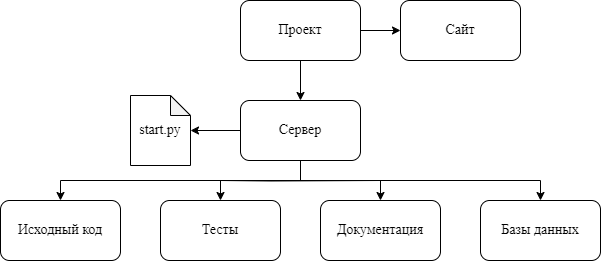
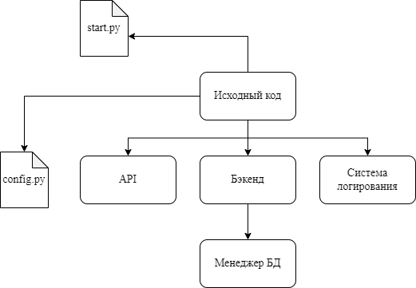
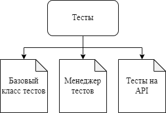
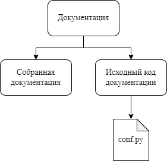
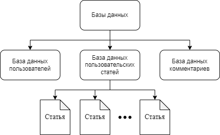

Архитектура сервера
===================

| Сервер можно разбить на несколько крупных частей.

#. :ref:`Исходный код`
#. :ref:`Архитектура тестов`
#. :ref:`Архитектура документации`
#. :ref:`Базы данных`

|

Исходный код
------------

| Исходный код состоит из файла ``server/start.py`` и всего содержимого директории ``server/src``.

|
| Рассмотрим смысловую нагрузку основных компонентов исходного кода:

* ``server/start.py``

   * Этот файл служит для запуска и настройки работы сервера

* API на данный момент состоит из одного файла ``server/src/api.py``

   * В этом файле реализованы API методы сервера
   * Эти методы принимают данные и предобрабатывают их, выполняя преобразование типов
   * Все *API* методы должны начинаться с префикса ``api_``

      * Это требование к названиям методов используется в тестах

* Бэкенд на данный момент состоит из одного файла ``server/src/backend.py``

   * В этом файле содержится логика обработки запросов к серверу

* ``server/src/config.py``

   * В этом файле содержаться константы используемые во время запуска и работы сервера

* Работа с базами данных осуществляется несколькими файлами в папке ``server/src/db``

   * Файл ``server/src/db/api.py`` используется в качестве менеджера баз данных

      * В этом файле реализована логика работы с базами данных
      * В этом файле нет функций, которые напрямую обращались бы к базам данных

   * Файл ``server/src/db/worker.py`` используется для описания логики работы с запросами к базам данных

      * В этом файле содержаться унифицированные функции для работы с базами данных

* Сервер имеет систему логирования, которая представлена в файле ``server/src/log.py``

   * Логи выписываются в текущую рабочую директорию сервера в папку ``log``
   * Логи *API* сервера выписываются в файл ``log/server_api.log``
   * Логи обращений к базам данных выписываются в файл ``log/db_api.log``

Архитектура тестов
------------------

| Все связанные с тестами файлы содержаться в директории ``server/tests``.

|
| Рассмотрим смысловую нагрузку основных компонентов тестов:

* Базовый класс для тестов определен в ``server/tests/base_test.py``

   * Этот файл содержит класс, от которого наследуются все тесты сервера
   * Класс включает в себя набор констант и методов, которые используются в большинстве тестов
   * Все тесты должны начинаться с префикса ``test_``

      * Это требование используется в менеджере тестов для поиска тестов
      * Все функции, которые не начинаются с такого префикса не считаются тестами

* Менеджер тестов представлен скриптом ``server/tests/run_tests.py``

   * Этот файл служит для запуска тестов
   * Запуск тестов поддерживает поиск тестов по регулярным выражениям и многократный запуск

* Тесты на API сервера описаны в ``server/tests/test_api.py``

   * В этом файле содержаться тесты на API сервера

Архитектура документации
------------------------

| Все связанные с документацией файлы содержаться в директории ``server/doc``.

|
| Рассмотрим смысловую нагрузку основных компонентов документации:

* Собранная документация располагается в директории ``server/doc/build``

   * Директория, в которой хранится документация
   * Эта директория создается при сборке документации

* Исходный код документации расположен в директории ``server/doc/source``

   * файлы в этой директории содержат в себе контент для документации (например, разметку страницы или картинки)
   * все картинки лежат в папке ``server/doc/source/images``

      * диаграмы созданы с помощью сайта `drawio <https://app.diagrams.net/>`_
      * картинки, которые содержат расширение *drawio* в названии, можно загрузить на сайт для редактирования

* Файл кофигурации сборки документации ``server/doc/source/conf.py``

   * Служит для задания стилей и других параметров документации

Базы данных
------------

На данный момент в сервере содержится три несвязанных друг с другом базы данных.
Каждая база данных имеет отдельную папку, расположенную по пути, который пользователь указывает при запуске сервера.
По умолчанию это путь ``server/db``. В каждой папке содержится база данных и допольнительные файлы,
связанные по смыслу с данными, хранимыми в базе.

|
| Рассмотрим смысловую нагрузку каждой базы данных.

База данных пользователей
^^^^^^^^^^^^^^^^^^^^^^^^^

   * Путь по умолчанию ``server/db/users``
   * Содержит в себе данные, характеризующие пользователей

| Ахртиектура базы данных пользователей выглядит следующим образом:

|

Название таблицы пользователей задается в файле конфигурации сервера. По умолчанию это ``users``.
Название уникального идентификатора пользователя *{id}* в базе данных задается в файле конфигурации сервера.
По умолчанию это ``user_id``.

База данных статей
^^^^^^^^^^^^^^^^^^

   * Путь по умолчанию ``server/db/articles``
   * Содержит в себе данные пользовательских статей
   * В папке содержатся файлы с названиями ``{id}.json``, где *id* - номер статьи в базе данных

| Ахртиектура базы данных статей выглядит следующим образом:

|

Название таблицы статей задается в файле конфигурации сервера. По умолчанию это ``articles``.
Название уникального идентификатора статьи *{id}* в базе данных задается в файле конфигурации сервера.
По умолчанию это ``article_id``.

Поле *preview* содержит в себе набор данных, необходимых для отображения превью статьи.
Данные в этом поле имееют следющий вид:

* ``name``

   * Имя статьи в формате *string*

* ``preview_content``

   * JSON объект для отображения картинки, видео или иного не текстового объекта
   * Поле ``type`` определяет тип контента в формате *string*

      * Допустимые значения *image* и *video*

   * Поле ``data`` содержит ссылку на нетекстовый объект в формате *string*

* ``tags``

   * Теги статьи в формате *string*

      * Все теги хранятся в одной строке через разделитель, определенный в файле конфигурации сервера
      * По умолчанию значение раздилителя ``~``

* ``date``

   * Дата создания статьи в формате *string*

* ``author``

   * JSON объект, который определяет автора статьи
   * Поле ``id`` содержит уникальный идентификатор пользователя в формате *integer*
   * Поле ``name`` содержит в себе имя пользователя в фомате *string*
   * Поле ``avatar`` содержит в себе ссылку на аватар пользователя в формате *string*

База данных комментариев
^^^^^^^^^^^^^^^^^^^^^^^^

   * Путь по умолчанию ``server/db/comments``
   * Содержит в себе данные комментариев

| Ахртиектура базы данных комментариев выглядит следующим образом:

Название таблицы комментариев задается в файле конфигурации сервера. По умолчанию это ``comments``.
Название уникального идентификатора комментария *{id}* в базе данных задается в файле конфигурации сервера.
По умолчанию это ``comment_id``.